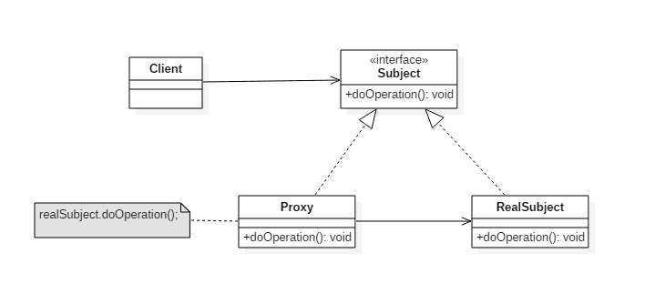

# 设计模式

参考：

- [菜鸟教程](https://www.runoob.com/design-pattern/design-pattern-intro.html)
- [Java 全栈知识体系](https://pdai.tech/md/dev-spec/pattern/1_overview.html)

## 基本概念

### 来源

在 1994 年，由 Erich Gamma、Richard Helm、Ralph Johnson 和 John Vlissides 四人合著出版了一本名为 **Design Patterns - Elements of Reusable Object-Oriented Software（中文译名：设计模式 - 可复用的面向对象软件元素）** 的书，该书首次提到了软件开发中设计模式的概念。

四位作者合称 **GoF（四人帮，全拼 Gang of Four）**。他们所提出的设计模式主要是基于以下的面向对象设计原则：

- 对接口编程而不是对实现编程。
- 优先使用对象组合而不是继承。

### 设计模式的优点

- 提供了一种共享的设计词汇和概念，使开发人员能够更好地沟通和理解彼此的设计意图。
- 提供了经过验证的解决方案，可以提高软件的可维护性、可复用性和灵活性。
- 促进了代码的重用，避免了重复的设计和实现。
- 通过遵循设计模式，可以减少系统中的错误和问题，提高代码质量。

### 设计模式的六大原则

1. 开闭原则（Open Close Principle）

	对扩展开放，对修改关闭，使程序的扩展性好，易于维护和升级。

	- 在程序需要进行拓展的时候，不用去修改原有的代码。
	- 需要基于接口和抽象类。

2. 里氏代换原则（Liskov Substitution Principle）

	任何基类可以出现的地方，子类一定可以出现。

	- 只有当派生类可以替换掉基类，且软件单位的功能不受到影响时，基类才能真正被复用，而派生类也能够在基类的基础上增加新的行为。
	- 里氏代换原则是对开闭原则的补充。实现开闭原则的关键步骤就是抽象化，而基类与子类的继承关系就是抽象化的具体实现，所以里氏代换原则是对实现抽象化的具体步骤的规范。

3. 依赖倒转原则（Dependence Inversion Principle）

	针对接口编程，依赖于抽象而不依赖于具体。（便于改动具体）

	- 这个原则是开闭原则的基础。

4. 接口隔离原则（Interface Segregation Principle）

	使用多个隔离的接口，比使用单个接口要好，这可以降低类之间的耦合度。（低耦合）

5. 迪米特法则，又称最少知道原则（Demeter Principle）

	一个实体应当尽量少地与其他实体之间发生相互作用，使得系统功能模块相对独立。（高内聚）

6. 合成复用原则（Composite Reuse Principle）

	尽量使用合成/聚合的方式，而不是使用继承。

### 分类

在 GOF 的书中提到的设计模式有 23 种，分三大类，此外，还有 J2EE（Java 2 Platform Enterprise Edition）设计模式：

- 创建型模式（Creational Patterns）

  这些设计模式提供了一种在创建对象的同时隐藏创建逻辑的方式，而不是使用 new 运算符直接实例化对象。这使得程序在判断针对某个给定实例需要创建哪些对象时更加灵活。

  - 单例模式（Singleton Pattern）
  - 工厂模式（Factory Pattern）
  	- 简单工厂模式（Simple Factory Pattern）
  	- 工厂方法模式（Factory Method Pattern）
  	- 抽象工厂模式（Abstract Factory Pattern）
  - 建造者模式（生成器模式，Builder Pattern）
  - 原型模式（Prototype Pattern）

- 结构型模式（Structural Patterns）

	这些模式关注对象之间的组合和关系，旨在解决如何构建灵活且可复用的类和对象结构。

	- 外观模式（Facade Pattern）
	- 适配器模式（Adapter Pattern）
	- 桥接模式（Bridge Pattern）
	- 过滤器模式（Filter、Criteria Pattern）
	- 组合模式（Composite Pattern）
	- 装饰器模式（Decorator Pattern）
	- 享元模式（Flyweight Pattern）
	- 代理模式（Proxy Pattern）

- 行为型模式（Behavioral Patterns）

	这些模式关注对象之间的通信和交互，旨在解决对象之间的责任分配和算法的封装。

	- 责任链模式（Chain of Responsibility Pattern）
	- 策略模式（Strategy Pattern）
	- 模板方法模式（Template Method Pattern）
	- 命令模式（Command Pattern）
	- 观察者模式（Observer Pattern）
	- 访问者模式（Visitor Pattern）
	- 状态模式（State Pattern）
	- 解释器模式（Interpreter Pattern）
	- 迭代器模式（Iterator Pattern）
	- 中介者模式（Mediator Pattern）
	- 备忘录模式（Memento Pattern）
	- 空对象模式（Null Object Pattern）（不属于 GoF 设计模式）

- J2EE 设计模式

	Java 2 Platform Enterprise Edition（J2EE，Java EE）设计模式特别关注表示层。这些模式是由 Sun Java Center 鉴定的。

	- MVC 模式（MVC Pattern）
	- 业务代表模式（Business Delegate Pattern）
	- 组合实体模式（Composite Entity Pattern）
	- 数据访问对象模式（Data Access Object Pattern，DAO 模式）
	- 前端控制器模式（Front Controller Pattern）
	- 拦截过滤器模式（Intercepting Filter Pattern）
	- 服务定位器模式（Service Locator Pattern）
	- 传输对象模式（Transfer Object Pattern）


## 创建型

### 单例模式

单例模式确保一个类只有一个实例，并提供该实例的全局访问点。

使用一个私有构造函数、一个私有静态变量以及一个公有静态函数来实现。

私有构造函数保证了不能通过构造函数来创建对象实例，只能通过公有静态函数返回唯一的私有静态变量：


#### 分类

有六种常用的实现方式：（懒汉表示延迟实例化即 lazy loading）

- 懒汉式-线程不安全（不建议使用）
- 饿汉式-线程安全（一般使用）
- 懒汉式-线程安全（不建议使用）
- 双重校验锁-线程安全（有特殊需求时使用）
- 静态内部类实现（需要 lazy loading 时使用，懒汉式-线程安全）
- 枚举实现（涉及反序列化时使用）


#### 懒汉式-线程不安全

```java
public class Singleton {

    private static Singleton uniqueInstance;

    private Singleton() {
    }

    public static Singleton getUniqueInstance() {
        if (uniqueInstance == null) {
            uniqueInstance = new Singleton();
        }
        return uniqueInstance;
    }
}
```

这个实现中，私有静态变量 uniqueInstance 被延迟实例化（延迟到调用 getUniqueInstance 方法时 ），如果没有手动用到该类，那么就不会实例化 uniqueInstance，从而节约资源。

这个实现在多线程环境下是不安全的，如果多个线程能够同时进入 `if (uniqueInstance == null)` ，并且此时 uniqueInstance 为 null，那么会有多个线程执行 `uniqueInstance = new Singleton();` 语句，这将导致多次实例化 uniqueInstance。

#### 饿汉式-线程安全

```java
private static Singleton uniqueInstance = new Singleton();
```

线程不安全问题主要是由于 uniqueInstance 被多次实例化，采取直接实例化 uniqueInstance 的方式就不会产生线程不安全问题。

但是直接实例化的方式也丢失了延迟实例化带来的节约资源的好处。

#### 懒汉式-线程安全

```java
public static synchronized Singleton getUniqueInstance() {
    if (uniqueInstance == null) {
        uniqueInstance = new Singleton();
    }
    return uniqueInstance;
}
```

只需要对 getUniqueInstance() 方法加锁，那么在一个时间点只能有一个线程能够进入该方法，从而避免了多次实例化 uniqueInstance 的问题。

但是当一个线程进入该方法之后，其它试图进入该方法的线程都必须等待，因此性能上有一定的损耗。

#### 双重校验锁-线程安全

```java
public class Singleton {

    private static volatile Singleton uniqueInstance;

    private Singleton() {
    }

    public static Singleton getUniqueInstance() {
        if (uniqueInstance == null) {
            synchronized (Singleton.class) {
                if (uniqueInstance == null) {
                    uniqueInstance = new Singleton();
                }
            }
        }
        return uniqueInstance;
    }
}
```

双重校验锁先判断 uniqueInstance 是否已经被实例化：

- 加锁操作只需要对实例化那部分的代码进行。
- 只有当 uniqueInstance 没有被实例化时，才需要进行加锁。

其中， `synchronized` （类锁）锁住了 Singleton 类，意味着也锁住了 `new Singleton()` 时调用的构造函数。

- 如果只使用了一个 if 语句：

```java
if (uniqueInstance == null) {
    synchronized (Singleton.class) {
        uniqueInstance = new Singleton();
    }
}
```

其中，在 uniqueInstance == null 的情况下，如果两个线程同时执行 if 语句，那么两个线程就会同时进入 if 语句块内。虽然在 if 语句块内有加锁操作，但是两个线程都会执行 `uniqueInstance = new Singleton();` 这条语句，只是先后的问题，那么就会进行两次实例化，从而产生了两个实例。因此必须使用双重校验，也就是需要使用两个 if 语句。

- 采用 volatile 关键字修饰 uniqueInstance ：

`uniqueInstance = new Singleton();` 这段代码其实是分为三步执行：

1. 分配内存空间
2. 初始化对象
3. 将 uniqueInstance 指向分配的内存地址

由于 JVM 具有指令重排的特性，有可能执行顺序变为了 1>3>2，这在单线程情况下没有问题，但在多线程下，第一个 `if` 语句中的 uniqueInstance 引用（在 synchronized 块之外）有可能获得一个还没有被初始化的实例（一个线程执行到 3 之后 2 之前时），如果线程访问到还未初始化的空间，程序就会出错。

使用 volatile 可以禁止 JVM 的指令重排，保证在多线程环境下也能正常运行。

#### 静态内部类实现

```java
public class Singleton {

    private Singleton() {
    }

    private static class SingletonHolder {
        private static final Singleton INSTANCE = new Singleton();
    }

    public static Singleton getUniqueInstance() {
        return SingletonHolder.INSTANCE;
    }
}
```

当 Singleton 类加载时，静态内部类 SingletonHolder 没有被加载进内存。只有当调用 `getUniqueInstance()` 方法从而触发 `SingletonHolder.INSTANCE` 时 SingletonHolder 才会被加载，此时初始化 INSTANCE 实例。

这种方式不仅具有延迟初始化的好处，而且由虚拟机提供了对线程安全的支持。

#### 枚举实现

```java
public enum Singleton {
    
    uniqueInstance;
    
    public void methods() {
        
    }
}
```

这是单例模式的最佳实践（但枚举类不可被继承），它实现简单，并且在面对复杂的序列化或者反射攻击的时候，能够防止实例化多次。

枚举实现时获取实例可采用以下方法：

```java
Singleton singleton = Singleton.uniqueInstance;   // 获取单例
singleton.methods();   // 调用单例的方法
```

- 对于反序列化时：

考虑下面的单例模式实现，该 Singleton 在每次反序列化的时候都会创建一个新的实例，为了保证只创建一个实例，必须声明所有字段都是 transient，并且重写 readResolve() 方法：

```java
public class Singleton implements Serializable {

    private static Singleton uniqueInstance;

    private Singleton() {
    }

    public static synchronized Singleton getUniqueInstance() {
        if (uniqueInstance == null) {
            uniqueInstance = new Singleton();
        }
        return uniqueInstance;
    }
}
```

- 对于反射攻击时：

如果不使用枚举来实现单例模式，会出现反射攻击，其通过 setAccessible() 方法可以将私有构造函数的访问级别设置为 public，然后调用构造函数从而实例化对象。如果要防止这种攻击，需要在构造函数中添加防止实例化第二个对象的代码。

### 工厂模式

#### 分类

工厂模式有三种类型：

- 简单工厂模式（Simple Factory Pattern）

	简单工厂模式不是一个正式的设计模式，但它是工厂模式的基础。它使用一个单独的工厂类来创建不同的对象，根据传入的参数决定创建哪种类型的对象。

- 工厂方法模式（Factory Method Pattern）

	工厂方法模式定义了一个创建对象的接口，将对象的创建延迟到子类，由子类决定实例化哪个类。

- 抽象工厂模式（Abstract Factory Pattern）

	抽象工厂模式提供一个创建一系列相关或互相依赖对象的接口，而无需指定它们具体的类。

#### 应用场景

需要在不同条件下创建不同实例时。

- 汽车制造：你需要一辆汽车，只需从工厂提货，而不需要关心汽车的制造过程及其内部实现。
- 日志记录：日志可能记录到本地硬盘、系统事件、远程服务器等，用户可以选择记录日志的位置。
- 数据库访问：当用户不知道最终系统使用哪种数据库，或者数据库可能变化时。
- 连接服务器的框架设计：需要支持 "POP3"、"IMAP"、"HTTP" 三种协议，可以将这三种协议作为产品类，共同实现一个接口。

#### 优缺点

优点：

- 调用者只需要知道对象的名称（或相关信息）即可创建对象。
- 扩展性高，如果需要增加新产品，只需扩展一个工厂类即可。
- 屏蔽了产品的具体实现，调用者只关心产品的接口。

缺点：

- 每次增加一个产品时，都需要增加一个具体类和对应的工厂，使系统中类的数量成倍增加，增加了系统的复杂度和具体类的依赖。

#### 角色

- 抽象产品（Abstract Product）

	定义了产品的共同接口或抽象类。它可以是具体产品类的父类或接口，规定了产品对象的共同方法。

- 具体产品（Concrete Product）

	实现了抽象产品接口，定义了具体产品的特定行为和属性。

- 抽象工厂（Abstract Factory）

	声明了创建产品的抽象方法，可以是接口或抽象类。它可以有多个方法用于创建不同类型的产品。

- 具体工厂（Concrete Factory）

	实现了抽象工厂接口，负责实际创建具体产品的对象。

#### 简单工厂模式

简单工厂不是设计模式，更像是一种编程习惯。它把实例化的操作单独放到一个类中，这个类就成为简单工厂类，让简单工厂类来决定应该用哪个具体子类来实例化。


##### 实现

```java
public interface Product {
}
```

```java
public class ConcreteProduct implements Product {
}
```

```java
public class ConcreteProduct1 implements Product {
}
```

```java
public class ConcreteProduct2 implements Product {
}
```

SimpleFactory  被所有需要进行实例化的客户类调用:

```java
public class SimpleFactory {
    public Product createProduct(int type) {
        if (type == 1) {
            return new ConcreteProduct1();
        } else if (type == 2) {
            return new ConcreteProduct2();
        }
        return new ConcreteProduct();
    }
}
```

```java
public class Client {
    public static void main(String[] args) {
        SimpleFactory simpleFactory = new SimpleFactory();
        Product product = simpleFactory.createProduct(1);
        // do something with the product
    }
}
```

#### 工厂方法模式

在简单工厂模式中，创建对象的是工厂类，而在工厂方法模式中，是由工厂子类（具体工厂）来创建对象。

##### 实现

下图中，Factory 有一个 doSomething() 方法，这个方法需要用到一个产品对象，这个产品对象由 factoryMethod() 方法创建。该方法是抽象的，需要一个工厂子类（具体工厂）去实现：


```java
public abstract class Factory {
    
    abstract public Product factoryMethod();
    
    public void doSomething() {
        Product product = factoryMethod();
        // do something with the product
    }
}
```

```java
public class ConcreteFactory extends Factory {
    public Product factoryMethod() {
        return new ConcreteProduct();
    }
}
```

```java
public class ConcreteFactory1 extends Factory {
    public Product factoryMethod() {
        return new ConcreteProduct1();
    }
}
```

```java
public class ConcreteFactory2 extends Factory {
    public Product factoryMethod() {
        return new ConcreteProduct2();
    }
}
```

#### 抽象工厂模式

抽象工厂创建的是多个相关的对象，它们需要被一起创建出来。

##### 实现

抽象工厂模式用到了工厂方法模式来创建单一对象，AbstractFactory 中的 createProductA() 和 createProductB() 方法都是让子类来实现，这两个方法单独来看就是在创建一个对象，这符合工厂方法模式的定义。

至于创建对象的家族这一概念是在 Client 体现，Client 要通过 AbstractFactory 同时调用两个方法来创建出两个对象，在这里这两个对象就有很大的相关性，Client 需要同时创建出这两个对象。

```java
public class AbstractProductA {
}
```

```java
public class AbstractProductB {
}
```

```java
public class ProductA1 extends AbstractProductA {
}
```

```java
public class ProductA2 extends AbstractProductA {
}
```

```java
public class ProductB1 extends AbstractProductB {
}
```

```java
public class ProductB2 extends AbstractProductB {
}
```

```java
public abstract class AbstractFactory {
    abstract AbstractProductA createProductA();
    abstract AbstractProductB createProductB();
}
```

```java
public class ConcreteFactory1 extends AbstractFactory {
    AbstractProductA createProductA() {
        return new ProductA1();
    }

    AbstractProductB createProductB() {
        return new ProductB1();
    }
}
```

```java
public class ConcreteFactory2 extends AbstractFactory {
    AbstractProductA createProductA() {
        return new ProductA2();
    }

    AbstractProductB createProductB() {
        return new ProductB2();
    }
}
```

```java
public class Client {
    public static void main(String[] args) {
        AbstractFactory abstractFactory = new ConcreteFactory1();   // 只需要修改这里就能切换到 ConcreteFactory2
        AbstractProductA productA = abstractFactory.createProductA();
        AbstractProductB productB = abstractFactory.createProductB();
        // do something with productA and productB
    }
}
```

其中，可以进一步运用简单工厂模式来抽象获取不同 ConcreteFactory 的过程，设置一个工厂创造器/生成器类来根据条件获得工厂：

```java
public class ConcreteFactoryProducer {
    public static AbstractFactory getConcreteFactory(Type type) {
        if (type == 1) {
            return new ConcreteFactory1;
        } else (type == 2) {
            return new ConcreteFactory2;
        }
    }
}
```

### 建造者模式

建造者封装一个对象的构造过程，并允许按步骤构造。

可以将一个复杂的构建过程与其表示相分离，使得同样的构建过程可以创建不同的表示。

与工厂模式的区别是：建造者模式更加关注于零件装配的顺序。


##### 应用场景

当一些基本部件不变，而其组合经常变化时。

- 汉堡、可乐、薯条、炸鸡翅等是不变的，而其组合是经常变化的，生成出不同的"套餐"。
- Java 中的 `StringBuilder`。

##### 优缺点

优点：

- 分离构建过程和表示，使得构建过程更加灵活，可以构建不同的表示。
- 可以更好地控制构建过程，隐藏具体构建细节。
- 代码复用性高，可以在不同的构建过程中重复使用相同的建造者。

缺点：

- 如果产品的属性较少，建造者模式可能会导致代码冗余。
- 增加了系统的类和对象数量。

##### 实现

以下是一个简易的 StringBuilder 实现，参考了 JDK 1.8 源码。

```java
public class AbstractStringBuilder {
    protected char[] value;

    protected int count;

    public AbstractStringBuilder(int capacity) {
        count = 0;
        value = new char[capacity];
    }

    public AbstractStringBuilder append(char c) {
        ensureCapacityInternal(count + 1);
        value[count++] = c;
        return this;
    }

    private void ensureCapacityInternal(int minimumCapacity) {
        // overflow-conscious code
        if (minimumCapacity - value.length > 0)
            expandCapacity(minimumCapacity);
    }

    void expandCapacity(int minimumCapacity) {
        int newCapacity = value.length * 2 + 2;
        if (newCapacity - minimumCapacity < 0)
            newCapacity = minimumCapacity;
        if (newCapacity < 0) {
            if (minimumCapacity < 0) // overflow
                throw new OutOfMemoryError();
            newCapacity = Integer.MAX_VALUE;
        }
        value = Arrays.copyOf(value, newCapacity);
    }
}
```

```java
public class StringBuilder extends AbstractStringBuilder {
    public StringBuilder() {
        super(16);
    }

    @Override
    public String toString() {
        // Create a copy, don't share the array
        return new String(value, 0, count);
    }
}
```

```java
public class Client {
    public static void main(String[] args) {
        StringBuilder sb = new StringBuilder();
        final int count = 26;
        for (int i = 0; i < count; i++) {
            sb.append((char) ('a' + i));
        }
        System.out.println(sb.toString());   // 输出 abcdefghijklmnopqrstuvwxyz
    }
}
```

其中，多个 append 就是构建过程的一种表现。

### 原型模式

使用原型实例指定要创建对象的类型，通过复制这个原型来创建新对象。


#### 应用场景

当直接创建对象的代价比较大时，可以采用原型模式。

- 例如，一个对象需要在一个高代价的数据库操作之后被创建。可以缓存该对象，在下一个请求时返回它的克隆，在需要的时候更新数据库，以此来减少数据库调用。
- Java 中的 `Object.clone()` 方法。
- 类初始化需要消耗大量资源（如数据、硬件资源）
- 通过 `new` 创建对象需要复杂的数据准备或访问权限时。
- 通常与工厂方法模式一起使用，通过 `clone` 创建对象，然后由工厂方法提供给调用者。

#### 对比

初始化一个类开销较大的情况：

- 静态初始化

	如果类有静态成员、静态块或静态方法，这些在类加载时需要初始化，可能会引起较大的开销，特别是如果这些静态成员或块执行了复杂的操作。

- 构造函数复杂度

	如果类的构造函数执行了复杂的逻辑或需要进行长时间的初始化操作，初始化类的实例可能会比较耗时。

- 依赖的类非常多

	如果类依赖于其他类，初始化时可能需要加载并初始化这些依赖的类，这可能会导致较大的开销。

克隆一个类开销较大的情况：

- 深拷贝

	如果类的对象需要进行深拷贝，即复制对象及其所有引用的对象，而不仅仅是对象本身，这可能会导致较大的开销。特别是如果对象的属性中包含了大量数据或者引用了其他复杂的数据结构或对象，深拷贝可能需要大量的内存和计算资源。

- 对象状态：

	如果类的对象包含了大量的状态信息，而且这些状态信息需要在克隆时进行适当的处理，那么克隆的开销可能会比较大。

#### 优缺点

优点：

- 性能提高
- 避免构造函数的约束

缺点：

- 配备克隆方法需要全面考虑类的功能，对已有类可能较难实现，特别是处理不支持串行化的间接对象或含有循环结构的引用时。
- 浅拷贝需要通过实现 `Cloneable` 接口实现，深拷贝需要通过实现 `Serializable` 读取二进制流实现。

#### 对象

- 原型接口（Prototype Interface）

	定义一个用于克隆自身的接口，通常包括一个 `clone()` 方法。

- 具体原型类（Concrete Prototype）

	实现原型接口的具体类，负责实际的克隆操作。这个类需要实现 `clone()` 方法，通常使用浅拷贝或深拷贝来复制自身。

- 客户端（Client）

	使用原型实例来创建新的对象。客户端调用原型对象的 `clone()` 方法来创建新的对象，而不是直接使用构造函数。

#### 实现

```java
public abstract class Prototype {
    abstract Prototype myClone();
}
```

```java
public class ConcretePrototype extends Prototype {

    private String filed;

    public ConcretePrototype(String filed) {
        this.filed = filed;
    }

    @Override
    Prototype myClone() {
        return new ConcretePrototype(filed);
    }

    @Override
    public String toString() {
        return filed;
    }
}
```

```java
public class Client {
    public static void main(String[] args) {
        Prototype prototype = new ConcretePrototype("abc");
        Prototype clone = prototype.myClone();
        System.out.println(clone.toString());   // 输出 abc
    }
}
```

## 结构型

### 外观模式

外观模式提供一个统一的接口，用来访问子系统中的一群接口，从而让子系统更容易使用。

这遵从最少知识原则: 客户对象所需要交互的对象应当尽可能少。

避免过度使用外观模式，以免隐藏过多的细节，导致维护困难。


#### 应用场景

外观模式可用于层次化结构，可以为每一层提供一个清晰的入口。

- Java 三层架构

	通过外观模式简化对表示层、业务逻辑层和数据访问层的访问。

#### 优缺点

优点：

- 减少依赖

	客户端与子系统之间的依赖减少。

- 提高灵活性

	子系统的内部变化不会影响客户端。

- 增强安全性

	隐藏了子系统的内部实现，只暴露必要的操作。

缺点：

- 违反开闭原则

	对子系统的修改可能需要对外观类进行相应的修改。

#### 角色

- 外观（Facade）

	提供一个简化的接口，封装了系统的复杂性。外观模式的客户端通过与外观对象交互，而无需直接与系统的各个组件打交道。

- 子系统（Subsystem）

	由多个相互关联的类组成，负责系统的具体功能。外观对象通过调用这些子系统来完成客户端的请求。

- 客户端（Client）

	使用外观对象来与系统交互，而不需要了解系统内部的具体实现。

#### 实现

观看电影需要操作很多步骤，使用外观模式实现一键看电影功能：

```java
public class SubSystem {
    public void turnOnTV() {
        System.out.println("turnOnTV()");
    }

    public void setCD(String cd) {
        System.out.println("setCD( " + cd + " )");
    }

    public void starWatching(){
        System.out.println("starWatching()");
    }
}
```

```java
public class Facade {
    private SubSystem subSystem = new SubSystem();

    public void watchMovie() {
        subSystem.turnOnTV();
        subSystem.setCD("a movie");
        subSystem.starWatching();
    }
}
```

```java
public class Client {
    public static void main(String[] args) {
        Facade facade = new Facade();
        facade.watchMovie();
    }
}
```

### 适配器模式

适配器让原本接口不兼容的类可以进行合作， 对象适配器使用组合，类适配器使用多重继承。


#### 应用场景

- 在软件系统中，需要将现有的对象放入新环境，而新环境要求的接口与现有对象不匹配。
- 希望创建一个可复用的类，与多个不相关的类（包括未来可能引入的类）一起工作，这些类可能没有统一的接口。
- 通过接口转换，将一个类集成到另一个类系中。
- 跨平台运行：在 Linux 上运行 Windows 程序。
- 数据库连接：Java 中的 JDBC 通过适配器模式与不同类型的数据库进行交互。

#### 优缺点

优点：

- 促进了类之间的协同工作，即使它们没有直接的关联。
- 提高了类的复用性。
- 增加了类的透明度。
- 提供了良好的灵活性。

缺点：

- 过度使用适配器可能导致系统结构混乱，难以理解和维护。
- 在 Java 中，由于只能继承一个类，因此只能适配一个类，且目标类必须是抽象的。

#### 角色

- 目标接口（Target）

	定义客户需要的接口。

- 被适配者类（Adaptee）

	定义一个已经存在的接口，这个接口需要适配。

- 适配器类（Adapter）

	实现目标接口，并通过组合或继承的方式调用被适配者类中的方法，从而实现目标接口。

#### 实现

鸭子(Duck)和火鸡(Turkey)拥有不同的叫声，Duck 的叫声调用 quack() 方法，而 Turkey 调用 gobble() 方法。

要求将 Turkey 的 gobble() 方法适配成 Duck 的 quack() 方法，从而让火鸡冒充鸭子：

```java
public interface Duck {
    void quack();
}
```

```java
public interface Turkey {
    void gobble();
}
```

```java
public class WildTurkey implements Turkey {
    @Override
    public void gobble() {
        System.out.println("gobble!");
    }
}
```

```java
public class TurkeyAdapter implements Duck {
    Turkey turkey;

    public TurkeyAdapter(Turkey turkey) {
        this.turkey = turkey;
    }

    @Override
    public void quack() {
        turkey.gobble();
    }
}
```

```java
public class Client {
    public static void main(String[] args) {
        Turkey turkey = new WildTurkey();
        Duck duck = new TurkeyAdapter(turkey);
        duck.quack();
    }
}
```

### 桥接模式

桥接模式将抽象与实现分离，使它们可以独立变化。

- Abstraction: 定义抽象类的接口
- Implementor: 定义实现类接口


#### 应用场景

- 当系统可能从多个角度进行分类，且每个角度都可能独立变化时，桥接模式是合适的。
- 墙上的开关：开关（抽象）与内部实现（实现）的分离，用户无需关心开关的内部工作机制。
- 当系统需要在抽象化角色和具体化角色之间增加灵活性时，考虑使用桥接模式。
- 对于不希望使用继承或因多层次继承导致类数量急剧增加的系统，桥接模式特别适用。
- 当一个类存在两个独立变化的维度，且这两个维度都需要扩展时，使用桥接模式。

#### 优缺点

优点：

- 抽象与实现分离：提高了系统的灵活性和可维护性。
- 扩展能力强：可以独立地扩展抽象和实现。
- 实现细节透明：用户不需要了解实现细节。

缺点：

- 理解与设计难度：桥接模式增加了系统的理解与设计难度。
- 聚合关联：要求开发者在抽象层进行设计与编程。

##### 角色

- 抽象（Abstraction）

	定义抽象接口，通常包含对实现接口的引用。

- 扩展抽象（Refined Abstraction）

	对抽象的扩展，可以是抽象类的子类或具体实现类。

- 实现（Implementor）

	定义实现接口，提供基本操作的接口。

- 具体实现（Concrete Implementor）

	实现实现接口的具体类。

##### 实现

RemoteControl 表示遥控器，指代 Abstraction 。

TV 表示电视，指代 Implementor 。

```java
public abstract class TV {

    public abstract void tuneChannel();
}
```

```java
public class Sony extends TV {
    
    @Override
    public void tuneChannel() {
        System.out.println("Sony.tuneChannel()");
    }
}
```


```java
public class RCA extends TV {

    @Override
    public void tuneChannel() {
        System.out.println("RCA.tuneChannel()");
    }
}
```


```java
public abstract class RemoteControl {
    protected TV tv;

    public RemoteControl(TV tv) {
        this.tv = tv;
    }

    public abstract void tuneChannel();
}
```


```java
public class ConcreteRemoteControl1 extends RemoteControl {
    public ConcreteRemoteControl1(TV tv) {
        super(tv);
    }

    @Override
    public void tuneChannel() {
        System.out.println("ConcreteRemoteControl1.tuneChannel()");
        tv.tuneChannel();
    }
}
```


```java
public class ConcreteRemoteControl2 extends RemoteControl {
    public ConcreteRemoteControl2(TV tv) {
        super(tv);
    }

    @Override
    public void tuneChannel() {
        System.out.println("ConcreteRemoteControl2.tuneChannel()");
        tv.tuneChannel();
    }
}
```


```java
public class Client {
    public static void main(String[] args) {
        RemoteControl remoteControl = new ConcreteRemoteControl1(new RCA());   // 这里的 TV 和 ConcreteRemoteControl 可以独立更换
        
        remoteControl.tuneChannel();
    }
}
```


桥接模式将遥控器和电视分离开来，从而可以独立改变遥控器或者电视的实现。

### 组合模式

组合模式将对象组合成树形结构来表示“整体/部分”层次关系，允许用户以相同的方式处理单独对象和组合对象。

组件（Component）类是组合类（Composite）和叶子类（Leaf）的父类，组件可以包含多个组件，组合类是包含多个组件的组件，组合类可以作为树的中间节点。

组合对象包含一个或者多个组件对象，因此组合对象的操作可以委托给内部的组件对象处理，而组件对象可以是另一个组合对象或者叶子对象。


#### 应用场景

- 当需要表示对象的层次结构时，如文件系统或组织结构。
- 当希望客户端代码能够以一致的方式处理树形结构中的所有对象时。
- 算术表达式：构建一个由操作数、操作符和子表达式组成的树形结构。

#### 优缺点

优点：

- 简化客户端代码：客户端可以统一处理所有类型的节点。
- 易于扩展：可以轻松添加新的叶子类型或树枝类型。

缺点：

- 违反依赖倒置原则：组件的声明是基于具体类而不是接口，这可能导致代码的灵活性降低。

#### 角色

- 组件（Component）

	定义了组合中所有对象的通用接口，可以是抽象类或接口。它声明了用于访问和管理子组件的方法，包括添加、删除、获取子组件等。

- 叶子节点（Leaf）

	表示组合中的叶子节点对象，叶子节点没有子节点。它实现了组件接口的方法，但通常不包含子组件。

- 复合节点（Composite）

	表示组合中的复合对象，复合节点可以包含子节点，可以是叶子节点，也可以是其他复合节点。它实现了组件接口的方法，包括管理子组件的方法。

- 客户端（Client）

	通过组件接口与组合结构进行交互，客户端不需要区分叶子节点和复合节点，可以一致地对待整体和部分。

#### 实现

```java
public abstract class Component {
    protected String name;

    public Component(String name) {
        this.name = name;
    }

    public void print() {
        print(0);
    }

    abstract void print(int level);

    abstract public void add(Component component);

    abstract public void remove(Component component);
}
```

```java
public class Composite extends Component {

    private List<Component> child;

    public Composite(String name) {
        super(name);
        child = new ArrayList<>();
    }

    @Override
    void print(int level) {
        for (int i = 0; i < level; i++) {
            System.out.print("--");
        }
        System.out.println("Composite:" + name);
        for (Component component : child) {
            component.print(level + 1);
        }
    }

    @Override
    public void add(Component component) {
        child.add(component);
    }

    @Override
    public void remove(Component component) {
        child.remove(component);
    }
}
```


```java
public class Leaf extends Component {
    public Leaf(String name) {
        super(name);
    }

    @Override
    void print(int level) {
        for (int i = 0; i < level; i++) {
            System.out.print("--");
        }
        System.out.println("left:" + name);
    }

    @Override
    public void add(Component component) {
        throw new UnsupportedOperationException(); // 牺牲透明性换取单一职责原则，这样就不用考虑是叶子节点还是组合节点
    }

    @Override
    public void remove(Component component) {
        throw new UnsupportedOperationException();
    }
}
```


```java
public class Client {
    public static void main(String[] args) {
        Composite root = new Composite("root");
        Component node1 = new Leaf("1");
        Component node2 = new Composite("2");
        Component node3 = new Leaf("3");
        root.add(node1);
        root.add(node2);
        root.add(node3);
        Component node21 = new Leaf("21");
        Component node22 = new Composite("22");
        node2.add(node21);
        node2.add(node22);
        Component node221 = new Leaf("221");
        node22.add(node221);
        root.print();
    }
}

// 输出
Composite:root
--left:1
--Composite:2
----left:21
----Composite:22
------left:221
--left:3
```

### 装饰器模式

装饰器模式动态地将功能附加到对象上, 若要扩展功能, 装饰者提供了比继承更有弹性的替代方案。

装饰者（Decorator）和具体组件（ConcreteComponent）都继承自组件（Component）：

- 被装饰类应该对扩展开放，对修改关闭，也就是添加新功能时不需要修改代码。
- 具体组件的方法实现不需要依赖于其它对象，而装饰者装饰（附着）在一个组件上，这样它可以装饰其它装饰者或者具体组件。
- 组件可具备嵌套关系。


#### 优缺点

优点

- 低耦合：装饰类和被装饰类可以独立变化，互不影响。
- 灵活性：可以动态地添加或撤销功能。
- 替代继承：提供了一种继承之外的扩展对象功能的方式。

缺点

- 复杂性：多层装饰可能导致系统复杂性增加。

#### 角色

- 抽象组件（Component）

	定义了原始对象和装饰器对象的公共接口或抽象类，可以是具体组件类的父类或接口。

- 具体组件（Concrete Component）

	是被装饰的原始对象，它定义了需要添加新功能的对象。

- 抽象装饰器（Decorator）

	继承自抽象组件，它包含了一个抽象组件对象，并定义了与抽象组件相同的接口，同时可以通过组合方式持有其他装饰器对象。

- 具体装饰器（Concrete Decorator）

	实现了抽象装饰器的接口，负责向抽象组件添加新的功能。具体装饰器通常会在调用原始对象的方法之前或之后执行自己的操作。

#### 实现

假设不同种类的饮料，饮料可以添加配料，比如可以添加牛奶，并且支持动态添加新配料。每增加一种配料，该饮料的价格就会增加，要求计算一种饮料的价格。

以下代码表示在 DarkRoast 饮料上新增新添加 Mocha 配料，之后又添加了 Whip 配料。DarkRoast 被 Mocha 包裹，Mocha 又被 Whip 包裹。它们都继承自相同父类，都有 cost() 方法，外层类的 cost() 方法调用了内层类的 cost() 方法。

```java
public interface Beverage {
    double cost();
}
```

```java
public class DarkRoast implements Beverage {
    @Override
    public double cost() {
        return 1;
    }
}
```


```java
public class HouseBlend implements Beverage {
    @Override
    public double cost() {
        return 1;
    }
}
```


```java
// 抽象装饰器
public abstract class CondimentDecorator implements Beverage {   // 可以用 Beverage 类型引用 CondimentDecorator 类
    protected Beverage beverage;
}
```


```java
// 具体装饰器
public class Milk extends CondimentDecorator {

    public Milk(Beverage beverage) {
        this.beverage = beverage;
    }

    @Override
    public double cost() {
        return 1 + beverage.cost();
    }
}
```


```java
// 具体装饰器
public class Mocha extends CondimentDecorator {

    public Mocha(Beverage beverage) {
        this.beverage = beverage;
    }

    @Override
    public double cost() {
        return 1 + beverage.cost();
    }
}
```


```java
public class Client {
    public static void main(String[] args) {
        Beverage beverage = new HouseBlend();
        beverage = new Mocha(beverage);
        beverage = new Milk(beverage);
        System.out.println(beverage.cost());
    }
}

// output:
3.0
```

其中，饮料可以动态添加新的配料，而不需要去修改饮料的代码。（实际上，配料不应该这样设计，配料应该设计为饮料包含的元素列表）

### 享元模式

利用共享的方式来支持大量细粒度的对象，这些对象一部分内部状态是相同的。

要注意：

- 状态分离

	明确区分内部状态和外部状态，避免混淆。

	- IntrinsicState: 内部状态，享元对象共享内部状态
	- ExtrinsicState: 外部状态，每个享元对象的外部状态不同

- 享元工厂

	使用享元工厂来控制对象的创建和复用，确保对象的一致性和完整性。


#### 应用场景

- 对象的创建和销毁成本较高时，通过共享对象来减少创建大量相似对象的内存消耗。
- 对象的状态可以外部化，即对象的部分状态可以独立于对象本身存在。
- Java 中的 String 对象：字符串常量池中已经存在的字符串会被复用。
- 数据库连接池：数据库连接被复用，避免频繁创建和销毁连接。

#### 优缺点

优点：

- 减少内存消耗：通过共享对象，减少了内存中对象的数量。
- 提高效率：减少了对象创建的时间，提高了系统效率。

缺点：

- 增加系统复杂度：需要分离内部状态和外部状态，增加了设计和实现的复杂性。
- 线程安全问题：如果外部状态处理不当，可能会引起线程安全问题。

#### 角色

- 享元工厂（Flyweight Factory）

	负责创建和管理享元对象，通常包含一个（缓存）池用于存储和复用已经创建的享元对象。

- 具体享元（Concrete Flyweight）

	实现了抽象享元接口，包含了内部状态和外部状态。内部状态是可以被共享的，而外部状态则由客户端传递。

- 抽象享元（Flyweight）:

	定义了具体享元和非共享享元的接口，通常包含了设置外部状态的方法。

- 客户端（Client）

	使用享元工厂获取享元对象，并通过设置外部状态来操作享元对象。客户端通常不需要关心享元对象的具体实现。

#### 实现

```java
public interface Flyweight {
    void doOperation(String extrinsicState);
}
```

```java
public class ConcreteFlyweight implements Flyweight {

    private String intrinsicState;

    public ConcreteFlyweight(String intrinsicState) {
        this.intrinsicState = intrinsicState;
    }

    @Override
    public void doOperation(String extrinsicState) {
        System.out.println("Object address: " + System.identityHashCode(this));
        System.out.println("IntrinsicState: " + intrinsicState);
        System.out.println("ExtrinsicState: " + extrinsicState);
    }
}
```

```java
public class FlyweightFactory {

    private HashMap<String, Flyweight> flyweights = new HashMap<>();

    Flyweight getFlyweight(String intrinsicState) {
        if (!flyweights.containsKey(intrinsicState)) {
            Flyweight flyweight = new ConcreteFlyweight(intrinsicState);
            flyweights.put(intrinsicState, flyweight);
        }
        return flyweights.get(intrinsicState);
    }
}
```

```java
public class Client {
    public static void main(String[] args) {
        FlyweightFactory factory = new FlyweightFactory();
        Flyweight flyweight1 = factory.getFlyweight("aa");
        Flyweight flyweight2 = factory.getFlyweight("aa");
        flyweight1.doOperation("x");
        flyweight2.doOperation("y");
    }
}

// output：
Object address: 1163157884
IntrinsicState: aa
ExtrinsicState: x
Object address: 1163157884
IntrinsicState: aa
ExtrinsicState: y
```

其中，使用哈希表存储已经创建的享元对象，以便快速检索。

### 代理模式

代理模式为另一个对象提供一个替身或占位符以控制对这个对象的访问。

代理一般有四类：

- 远程代理（Remote Proxy）

	控制对远程对象(不同地址空间)的访问，它负责将请求及其参数进行编码，并向不同地址空间中的对象发送已经编码的请求。

- 虚拟代理（Virtual Proxy）

	根据需要创建开销很大的对象，它可以缓存实体的附加信息，以便延迟对它的访问，例如在网站加载一个很大图片时，不能马上完成，可以用虚拟代理缓存图片的大小信息，然后生成一张临时图片代替原始图片。

- 保护代理（Protection Proxy）

	按权限控制对象的访问，它负责检查调用者是否具有实现一个请求所必须的访问权限。

- 智能引用（Smart Reference）

	比如智能指针，它在访问对象时执行一些附加操作: 记录对象的引用次数；当第一次引用一个持久化对象时，将它装入内存；在访问一个实际对象前，检查是否已经锁定了它，以确保其它对象不能改变它。



对比：

- 与适配器模式的区别

	适配器模式改变接口，而代理模式不改变接口。

- 与装饰器模式的区别

	装饰器模式用于增强功能，代理模式用于控制访问，不增强类本身的功能。

#### 应用场景

- 快捷方式：Windows系统中的快捷方式作为文件或程序的代理。
- 代售点：购买火车票时，代售点作为火车站的代理。
- 支票：作为银行账户资金的代理，控制资金的访问。
- SpringAOP：使用代理模式来实现面向切面编程。

#### 优缺点

优点：

- 职责分离：代理模式将访问控制与业务逻辑分离。
- 扩展性：可以灵活地添加额外的功能或控制。
- 智能化：可以智能地处理访问请求，如延迟加载、缓存等。

缺点：

- 性能开销：增加了代理层可能会影响请求的处理速度。
- 实现复杂性：某些类型的代理模式实现起来可能较为复杂。

##### 角色

- 抽象主体（Subject）

	定义了真实主体和代理主体的共同接口，这样在任何使用真实主体的地方都可以使用代理主体。

- 真实主体（Real Subject）

	实现了抽象主体接口，是代理对象所代表的真实对象。客户端直接访问真实主体，但在某些情况下，可以通过代理主体来间接访问。

- 代理（Proxy）

	实现了抽象主体接口，并持有对真实主体的引用。代理主体通常在真实主体的基础上提供一些额外的功能，例如延迟加载、权限控制、日志记录等。

- 客户端（Client）

	使用抽象主体接口来操作真实主体或代理主体，不需要知道具体是哪一个实现类。

##### 实现

```java
public interface Image {
    void showImage();
}
```

```java
public class HighResolutionImage implements Image {

    private URL imageURL;
    private long startTime;
    private int height;
    private int width;

    public int getHeight() {
        return height;
    }

    public int getWidth() {
        return width;
    }

    public HighResolutionImage(URL imageURL) {
        this.imageURL = imageURL;
        this.startTime = System.currentTimeMillis();
        this.width = 600;
        this.height = 600;
    }

    public boolean isLoading() {
        // 模拟图片加载，延迟 3s 加载完成
        long endTime = System.currentTimeMillis();
        return endTime - startTime < 3000;
    }

    @Override
    public void showImage() {
        System.out.println("Real Image: " + imageURL);
    }
}
```


```java
public class ImageProxy implements Image {
    private HighResolutionImage highResolutionImage;

    public ImageProxy(HighResolutionImage highResolutionImage) {
        this.highResolutionImage = highResolutionImage;
    }

    @Override
    public void showImage() {
        while (highResolutionImage.isLoading()) {
            try {
                System.out.println("Temp Image: " + highResolutionImage.getWidth() + " " + highResolutionImage.getHeight());
                Thread.sleep(100);
            } catch (InterruptedException e) {
                e.printStackTrace();
            }
        }
        highResolutionImage.showImage();
    }
}
```


```java
public class ImageViewer {
    public static void main(String[] args) throws Exception {
        String image = "http://image.jpg";
        URL url = new URL(image);
        HighResolutionImage highResolutionImage = new HighResolutionImage(url);
        ImageProxy imageProxy = new ImageProxy(highResolutionImage);
        imageProxy.showImage();
    }
}
```

## 行为型

### 责任链

责任链模式，为某个请求创建一个对象链，将这些对象连成一条链，并沿着这条链发送该请求，直到有一个对象处理它为止，从而避免请求的发送者和接收者之间的耦合关系。


其中：Handler  定义处理请求的接口，并且实现后继链（successor）。

使用这种独立结点相互链接的递归结构，可以比直接管理结点集合更方便地支持条件处理逻辑（`and or`），以及树形结构的 handler 选择逻辑。

#### 应用场景

- 事件冒泡：在 JavaScript 中，事件从最具体的元素开始，逐级向上传播。
- Java Web 开发：过滤器链、拦截器链。

#### 优缺点

优点：

- 降低耦合度：发送者和接收者之间解耦。
- 简化对象：对象不需要知道链的结构。
- 灵活性：通过改变链的成员或顺序，动态地新增或删除责任。
- 易于扩展：增加新的请求处理类很方便。

缺点：

- 请求未被处理：不能保证请求一定会被链中的某个处理者接收。
- 性能影响：可能影响系统性能，且调试困难，可能导致循环调用。
- 难以观察：运行时特征不明显，可能妨碍除错。

#### 角色

- 抽象处理者（Handler）

	定义一个处理请求的接口，通常包含一个处理请求的方法（如 `handleRequest`）和一个指向下一个处理者的引用（后继者）。

- 具体处理者（ConcreteHandler）

	实现了抽象处理者接口，负责处理请求。如果能够处理该请求，则直接处理；否则，将请求传递给下一个处理者。

- 客户端（Client）

	创建处理者对象，并将它们连接成一条责任链。通常，客户端只需要将请求发送给责任链的第一个处理者，无需关心请求的具体处理过程。

#### 实现

```java
public abstract class Handler {
    protected Handler successor;

    public Handler(Handler successor) {
        this.successor = successor;
    }

    protected abstract void handleRequest(Request request);
}
```

```java
public class ConcreteHandler1 extends Handler {
    public ConcreteHandler1(Handler successor) {
        super(successor);
    }

    @Override
    protected void handleRequest(Request request) {
        if (request.getType() == RequestType.type1) {
            System.out.println(request.getName() + " is handle by ConcreteHandler1");
            return;
        }
        if (successor != null) {
            successor.handleRequest(request);
        }
    }
}
```

```java
public class ConcreteHandler2 extends Handler{
    public ConcreteHandler2(Handler successor) {
        super(successor);
    }

    @Override
    protected void handleRequest(Request request) {
        if (request.getType() == RequestType.type2) {
            System.out.println(request.getName() + " is handle by ConcreteHandler2");
            return;
        }
        if (successor != null) {
            successor.handleRequest(request);
        }
    }
}
```

```java
public class Request {
    private RequestType type;
    private String name;

    public Request(RequestType type, String name) {
        this.type = type;
        this.name = name;
    }

    public RequestType getType() {
        return type;
    }

    public String getName() {
        return name;
    }
}
```

```java
public enum RequestType {
    type1, type2
}
```

```java
public class Client {
    public static void main(String[] args) {
        // 组装责任链
        Handler handler1 = new ConcreteHandler1(null);
        Handler handler2 = new ConcreteHandler2(handler1);
        
        // 发送请求
        Request request1 = new Request(RequestType.type1, "request1");
        handler2.handleRequest(request1);
        Request request2 = new Request(RequestType.type2, "request2");
        handler2.handleRequest(request2);
    }
}

// output:
request1 is handle by ConcreteHandler1
request2 is handle by ConcreteHandler2
```

责任链也可以在一个 HandlerChain 中构建非递归的结构：

```java
public class HandlerChain {
    
    // handler 链表集合
    private Handler head;   // 链首
    private Handler tail;   // 链尾
    private List<Handler> handlers = new LinkedList<Handler>;
    
    
    // handler 数组集合
    private List<Handler> handlers = new Array<Handler>;
}
```

### 策略模式

策略模式定义了策略族，分别封装起来，让它们之间可以互相替换,，这让策略的变化独立于使用策略的客户。


其中：

- Strategy 接口定义了一个策略族，它们都具有 behavior() 方法。
- Context 是使用到该策略族的类，其中的 doSomething() 方法会调用 behavior()，setStrategy(in Strategy) 方法可以动态地改变 strategy 对象，也就是说能动态地改变 Context 所使用的策略。

#### 应用场景

- 当一个系统中有许多类，它们之间的区别仅在于它们的行为时。
- 旅行方式选择：骑自行车、坐汽车等，每种方式都是一个可替换的策略。
- 排序方法选择：统一的排序结构，提供不同的排序算法。

#### 优缺点

优点：

- 算法切换自由：可以在运行时根据需要切换算法。
- 避免多重条件判断：消除了复杂的条件语句。
- 扩展性好：新增算法只需新增一个策略类，无需修改现有代码。

缺点：

- 策略类数量增多：每增加一个算法，就需要增加一个策略类。
- 所有策略类都需要暴露：策略类需要对外公开，以便可以被选择和使用。

#### 角色

- 环境（Context）

	维护一个对策略对象的引用，负责将客户端请求委派给具体的策略对象执行。环境类可以通过依赖注入、简单工厂等方式来获取具体策略对象。

- 抽象策略（Abstract Strategy）

	定义了策略对象的公共接口或抽象类，规定了具体策略类必须实现的方法。

- 具体策略（Concrete Strategy）

	实现了抽象策略定义的接口或抽象类，包含了具体的算法实现。

#### 实现

设计一个鸭子，它可以动态地改变叫声。这里的策略族是鸭子的叫声行为。

```java
public interface QuackBehavior {
    void quack();
}
```

```java
public class Quack implements QuackBehavior {
    @Override
    public void quack() {
        System.out.println("quack!");
    }
}
```

```java
public class Squeak implements QuackBehavior{
    @Override
    public void quack() {
        System.out.println("squeak!");
    }
}
```

```java
public class Duck {
    private QuackBehavior quackBehavior;

    public void performQuack() {
        if (quackBehavior != null) {
            quackBehavior.quack();
        }
    }

    public void setQuackBehavior(QuackBehavior quackBehavior) {
        this.quackBehavior = quackBehavior;
    }
}
```

```java
public class Client {
    public static void main(String[] args) {
        Duck duck = new Duck();
        duck.setQuackBehavior(new Squeak());
        duck.performQuack();
        duck.setQuackBehavior(new Quack());
        duck.performQuack();
    }
}

// output:
squeak!
quack!
```

### 模版方法模式

模版方法模式在一个方法中定义一个算法的骨架，而将一些步骤延迟到子类中，使得子类可以在不改变算法结构的情况下，重新定义算法中的某些步骤。


#### 应用场景

- 多个子类中存在共用的方法时，通过将通用方法抽象到父类中来避免代码重复。
- Spring 对 Hibernate 的支持：封装了如开启事务、获取 Session、关闭 Session 等通用方法。
- 钩子方法，生命周期方法。

#### 优缺点

优点：

- 封装不变部分：算法的不变部分被封装在父类中。
- 扩展可变部分：子类可以扩展或修改算法的可变部分。
- 提取公共代码：减少代码重复，便于维护。

缺点：

- 类数目增加：每个不同的实现都需要一个子类，可能导致系统庞大。

#### 角色

- 抽象父类（Abstract Class）

	定义了模板方法和一些抽象方法或具体方法。

- 具体子类（Concrete Classes）

	继承自抽象父类，并实现抽象方法。

- 钩子方法（Hook Method）（可选）

	在抽象父类中定义，可以被子类重写，以影响模板方法的行为。

- 客户（Client）（可选）

	使用抽象父类和具体子类，无需关心模板方法的细节。

#### 实现

冲咖啡和冲茶都有类似的流程，但是某些步骤会有点不一样，要求复用那些相同步骤的代码。


```java
public abstract class CaffeineBeverage {

    // 为了防止恶意修改，模板方法通常使用 final 关键字修饰，避免被子类重写。
    final void prepareRecipe() {
        boilWater();
        brew();
        pourInCup();
        addCondiments();
    }

    abstract void brew();

    abstract void addCondiments();

    void boilWater() {
        System.out.println("boilWater");
    }

    void pourInCup() {
        System.out.println("pourInCup");
    }
}
```

```java
public class Coffee extends CaffeineBeverage {
    @Override
    void brew() {
        System.out.println("Coffee.brew");
    }

    @Override
    void addCondiments() {
        System.out.println("Coffee.addCondiments");
    }
}
```

```java
public class Tea extends CaffeineBeverage {
    @Override
    void brew() {
        System.out.println("Tea.brew");
    }

    @Override
    void addCondiments() {
        System.out.println("Tea.addCondiments");
    }
}
```

```java
public class Client {
    public static void main(String[] args) {
        CaffeineBeverage caffeineBeverage = new Coffee();
        caffeineBeverage.prepareRecipe();
        System.out.println("-----------");
        caffeineBeverage = new Tea();
        caffeineBeverage.prepareRecipe();
    }
}

// output:
boilWater
Coffee.brew
pourInCup
Coffee.addCondiments
-----------
boilWater
Tea.brew
pourInCup
Tea.addCondiments
```

### 命令模式

将命令封装成对象，以便使用命令来参数化其它对象，或者将命令对象放入队列中进行排队，或者将命令对象的操作记录到日志中，用于支持可撤销的操作。


其中：

- Command: 命令
- Receiver: 命令接收者，也就是命令的作用对象。
- Invoker: 通过它来调用，执行命令
- Client: 可以设置命令与命令的接收者

#### 应用场景

- 当需要对行为进行记录、撤销/重做或事务处理时，使用命令模式来解耦请求者和执行者。
- 在GUI中，每个按钮或菜单项可以视为一条命令。
- 在需要模拟命令行操作的场景中使用命令模式。

#### 优缺点

优点：

- 降低耦合度：请求者和执行者之间的耦合度降低。
- 易于扩展：新命令可以很容易地添加到系统中。

缺点：

- 过多命令类：系统可能会有过多的具体命令类，增加系统的复杂度。

#### 角色

- 命令（Command）

	定义了执行操作的接口，通常包含一个 `execute` 方法，用于调用具体的操作。

- 具体命令（ConcreteCommand）

	实现了命令接口，负责执行具体的操作。它通常包含了对接收者的引用，通过调用接收者的方法来完成请求的处理。

- 接收者（Receiver）

	知道如何执行与请求相关的操作，实际执行命令的对象。

- 调用者/请求者（Invoker）

	发送命令的对象，它包含了一个命令对象并能触发命令的执行。调用者并不直接处理请求，而是通过将请求传递给命令对象来实现。

- 客户端（Client）

	创建具体命令对象并设置其接收者，将命令对象交给调用者执行。

#### 实现

设计一个遥控器，可以控制电灯开关。

```java
public interface Command {
    void execute();
}
```

```java
public class LightOnCommand implements Command {
    Light light;

    public LightOnCommand(Light light) {
        this.light = light;
    }

    @Override
    public void execute() {
        light.on();
    }
}
```

```java
public class LightOffCommand implements Command {
    Light light;

    public LightOffCommand(Light light) {
        this.light = light;
    }

    @Override
    public void execute() {
        light.off();
    }
}
```

```java
/**
 * 电灯，Receiver
 */
public class Light {

    public void on() {
        System.out.println("Light is on!");
    }

    public void off() {
        System.out.println("Light is off!");
    }
}
```

```java
/**
 * 遥控器，Invoker
 */
public class Invoker {
    private Command[] onCommands;
    private Command[] offCommands;
    private final int slotNum = 7;

    public Invoker() {
        this.onCommands = new Command[slotNum];
        this.offCommands = new Command[slotNum];
    }

    public void setOnCommand(Command command, int slot) {
        onCommands[slot] = command;
    }

    public void setOffCommand(Command command, int slot) {
        offCommands[slot] = command;
    }

    public void onButtonWasPushed(int slot) {
        onCommands[slot].execute();
    }

    public void offButtonWasPushed(int slot) {
        offCommands[slot].execute();
    }
}
```

```java
public class Client {
    public static void main(String[] args) {
        Invoker invoker = new Invoker();
        Light light = new Light();

        // 创建命令
        Command lightOnCommand = new LightOnCommand(light);
        Command lightOffCommand = new LightOffCommand(light);
        
        // 设置命令
        invoker.setOnCommand(lightOnCommand, 0);
        invoker.setOffCommand(lightOffCommand, 0);
        
        // 调用命令
        invoker.onButtonWasPushed(0);
        invoker.offButtonWasPushed(0);
    }
}
```

### 观察者模式

观察者模式定义对象之间的一对多依赖，当一个对象状态改变时，它的所有依赖都会收到通知并且自动更新状态。

主体（Subject）是被观察的对象，而其所有依赖的对象称为观察者（Observer）。


主体(Subject)具有注册和移除观察者、并通知所有观察者的功能，基于观察者列表实现。

观察者(Observer)的注册功能需要调用主体的 registerObserver() 方法。

注意：

- 考虑使用Java内置的观察者模式支持类，如`java.util.Observable`和`java.util.Observer`。

- 避免循环引用

	注意观察者和主体之间的依赖关系，避免循环引用。

- 异步执行

	考虑使用异步通知避免单点故障导致整个系统卡壳。

#### 应用场景

- 当一个对象的状态变化需要同时更新其他对象时。
- 拍卖系统：拍卖师作为主体，竞价者作为观察者，拍卖价格更新时通知所有竞价者。

#### 优缺点

优点：

- 抽象耦合：观察者和主体之间是抽象耦合的。
- 触发机制：建立了一套状态改变时的触发和通知机制。

缺点：

- 性能问题：如果观察者众多，通知过程可能耗时。
- 循环依赖：可能导致循环调用和系统崩溃。
- 缺乏变化详情：观察者不知道主体如何变化，只知道变化发生。

#### 角色

- 主体（Subject）

	也称为被观察者或可观察者，它是具有状态的对象，并维护着一个观察者列表。主体提供了添加、删除和通知观察者的方法。

- 观察者（Observer）

	观察者是接收主体通知的对象。观察者需要实现一个更新方法，当收到主体的通知时，调用该方法进行更新操作。

- 具体主体（Concrete Subject）

	具体主体是主体的具体实现类。它维护着观察者列表，并在状态发生改变时通知观察者。

- 具体观察者（Concrete Observer）

	具体观察者是观察者的具体实现类。它实现了更新方法，定义了在收到主体通知时需要执行的具体操作。

#### 实现

天气数据布告板会在天气信息发生改变时更新其内容，布告板有多个，并且在将来会继续增加。

```java
public interface Subject {
    void resisterObserver(Observer o);

    void removeObserver(Observer o);

    void notifyObserver();
}
```

```java
public class WeatherData implements Subject {
    private List<Observer> observers;
    private float temperature;
    private float humidity;
    private float pressure;

    public WeatherData() {
        observers = new ArrayList<>();
    }

    public void setMeasurements(float temperature, float humidity, float pressure) {
        this.temperature = temperature;
        this.humidity = humidity;
        this.pressure = pressure;
        notifyObserver();
    }

    @Override
    public void resisterObserver(Observer o) {
        observers.add(o);
    }

    @Override
    public void removeObserver(Observer o) {
        int i = observers.indexOf(o);
        if (i >= 0) {
            observers.remove(i);
        }
    }

    @Override
    public void notifyObserver() {
        for (Observer o : observers) {
            o.update(temperature, humidity, pressure);
        }
    }
}
```

```java
public interface Observer {
    void update(float temp, float humidity, float pressure);
}
```

```java
public class StatisticsDisplay implements Observer {

    public StatisticsDisplay(Subject weatherData) {
        weatherData.resisterObserver(this);
    }

    @Override
    public void update(float temp, float humidity, float pressure) {
        System.out.println("StatisticsDisplay.update: " + temp + " " + humidity + " " + pressure);
    }
}
```

```java
public class CurrentConditionsDisplay implements Observer {

    public CurrentConditionsDisplay(Subject weatherData) {
        weatherData.resisterObserver(this);
    }

    @Override
    public void update(float temp, float humidity, float pressure) {
        System.out.println("CurrentConditionsDisplay.update: " + temp + " " + humidity + " " + pressure);
    }
}
```

```java
public class WeatherStation {
    public static void main(String[] args) {
        WeatherData weatherData = new WeatherData();
        CurrentConditionsDisplay currentConditionsDisplay = new CurrentConditionsDisplay(weatherData);
        StatisticsDisplay statisticsDisplay = new StatisticsDisplay(weatherData);

        weatherData.setMeasurements(0, 0, 0);
        weatherData.setMeasurements(1, 1, 1);
    }
}

// output:
CurrentConditionsDisplay.update: 0.0 0.0 0.0
StatisticsDisplay.update: 0.0 0.0 0.0
CurrentConditionsDisplay.update: 1.0 1.0 1.0
StatisticsDisplay.update: 1.0 1.0 1.0
```

### 访问者模式

对一个对象结构（比如组合结构）的元素添加 accept 方法，其接受 visitor 的访问，这使得结构的访问算法可以随着访问者改变而改变。

访问者模式旨在将数据结构与在该数据结构上执行的（访问）操作分离，从而使得添加新的（访问）操作变得更容易，而无需修改数据结构本身。


其中：

- Visitor

	访问者，为每一个 ConcreteElement 声明一个 visit 操作。

- ConcreteVisitor

	具体访问者，定义具体的访问过程。

- ObjectStructure

	对象结构，可以是组合结构，或者是一个集合。

#### 应用场景

- 当需要对一个对象结构中的对象执行多种不同的且不相关的操作时，尤其是这些操作需要避免"污染"对象类本身。
- 做客场景：访问者（如您）访问朋友家，朋友作为元素提供信息，访问者根据信息做出判断。
- 访问者模式可以用于功能统一，如报表生成、用户界面显示、拦截器和过滤器等。

#### 优缺点

优点：

- 单一职责原则：访问者模式符合单一职责原则，每个类只负责一项职责。
- 扩展性：容易为数据结构添加新的操作。
- 灵活性：访问者可以独立于数据结构变化。

缺点：

- 违反迪米特原则：元素需要向访问者公开其内部信息。
- 元素类难以变更：元素类需要维持与访问者的兼容。
- 依赖具体类：访问者模式依赖于具体类而不是接口，违反了依赖倒置原则。

#### 角色

- 访问者（Visitor）

	定义了访问元素的接口。

- 具体访问者（Concrete Visitor）

	实现访问者接口，提供对每个具体元素类的访问和相应操作。

- 元素（Element）

	定义了一个接受访问者的方法。

- 具体元素（Concrete Element）

	实现元素接口，提供一个`accept`方法，允许访问者访问并操作。

- 对象结构（Object Structure）（可选）

	定义了如何组装具体元素，如一个组合类。

- 客户端（Client）（可选）

	使用访问者模式对对象结构进行操作。

#### 实现

以下实现中定义了一个嵌套对象结构，其包含三种 Element ：

- Customer
- Order
- Item

这三种 Element 分别实现了 accept 访问的方法，visitor 也分别实现了 visit 这三种 Element 的方法。

```java
public interface Element {
    void accept(Visitor visitor);
}
```

```java
// 该嵌套对象结构的顶层
class CustomerGroup {

    private List<Customer> customers = new ArrayList<>();

    void accept(Visitor visitor) {
        for (Customer customer : customers) {
            customer.accept(visitor);   // visitor 从 CustomerGroup 访问 customer
        }
    }

    void addCustomer(Customer customer) {
        customers.add(customer);
    }
}
```

```java
public class Customer implements Element {

    private String name;
    private List<Order> orders = new ArrayList<>();

    Customer(String name) {
        this.name = name;
    }

    String getName() {
        return name;
    }

    void addOrder(Order order) {
        orders.add(order);
    }

    public void accept(Visitor visitor) {
        visitor.visit(this);   // accept 并进行 visit
        for (Order order : orders) {
            order.accept(visitor);   // visitor 从 customer 访问 order
        }
    }
}
```

```java
public class Order implements Element {

    private String name;
    private List<Item> items = new ArrayList();

    Order(String name) {
        this.name = name;
    }

    Order(String name, String itemName) {
        this.name = name;
        this.addItem(new Item(itemName));
    }

    String getName() {
        return name;
    }

    void addItem(Item item) {
        items.add(item);
    }

    public void accept(Visitor visitor) {
        visitor.visit(this);   // accept 并进行 visit
        for (Item item : items) {
            item.accept(visitor);   // visitor 从 order 访问 item
        }
    }
}
```

```java
public class Item implements Element {

    private String name;

    Item(String name) {
        this.name = name;
    }

    String getName() {
        return name;
    }

    public void accept(Visitor visitor) {    // accept 并进行 visit
        visitor.visit(this);   // this 是 Item 类型
    }
}
```

```java
public interface Visitor {   // 统一声明 visit 方法，分别实现访问三种 Element 的方法，
    void visit(Customer customer);

    void visit(Order order);

    void visit(Item item);
}
```

```java
// ConcreteVisitor
public class GeneralReport implements Visitor {

    private int customersNo;
    private int ordersNo;
    private int itemsNo;

    public void visit(Customer customer) {
        System.out.println(customer.getName());
        customersNo++;
    }

    public void visit(Order order) {
        System.out.println(order.getName());
        ordersNo++;
    }

    public void visit(Item item) {
        System.out.println(item.getName());
        itemsNo++;
    }

    public void displayResults() {
        System.out.println("Number of customers: " + customersNo);
        System.out.println("Number of orders:    " + ordersNo);
        System.out.println("Number of items:     " + itemsNo);
    }
}
```

```java
public class Client {
    public static void main(String[] args) {
        Customer customer1 = new Customer("customer1");
        customer1.addOrder(new Order("order1", "item1"));
        customer1.addOrder(new Order("order2", "item1"));
        customer1.addOrder(new Order("order3", "item1"));

        Order order = new Order("order_a");
        order.addItem(new Item("item_a1"));
        order.addItem(new Item("item_a2"));
        order.addItem(new Item("item_a3"));
        Customer customer2 = new Customer("customer2");
        customer2.addOrder(order);

        CustomerGroup customers = new CustomerGroup();
        customers.addCustomer(customer1);
        customers.addCustomer(customer2);

        GeneralReport visitor = new GeneralReport();
        customers.accept(visitor);
        visitor.displayResults();
    }
}

// output:
customer1
order1
item1
order2
item1
order3
item1
customer2
order_a
item_a1
item_a2
item_a3
Number of customers: 2
Number of orders:    4
Number of items:     6
```

### 状态模式

使得对象在内部状态改变时改变它的行为。


#### 应用场景

- 当代码中存在大量条件语句，且这些条件语句依赖于对象的状态时，通过将每个状态封装成独立的类，可以避免使用大量的条件语句来实现状态切换。
- 状态模式适用于状态数量有限（通常不超过 5 个）的情况，谨慎使用，以避免系统变得过于复杂。

#### 优缺点

优点：

- 封装状态转换规则：将状态转换逻辑封装在状态对象内部。
- 易于扩展：增加新的状态类不会影响现有代码。
- 集中状态相关行为：将所有与特定状态相关的行为集中到一个类中。
- 简化条件语句：避免使用大量的条件语句来切换行为。
- 状态共享：允许多个上下文对象共享同一个状态对象。

缺点:

- 增加类和对象数量：每个状态都需要一个具体的状态类。
- 实现复杂：模式结构和实现相对复杂。
- 开闭原则支持不足：增加新状态或修改状态行为可能需要修改现有代码。

#### 角色

- 上下文（Context）

	定义了客户感兴趣的接口，并维护一个当前状态对象的引用。上下文可以通过状态对象来委托处理状态相关的行为。

- 状态（State）

	定义了一个接口，用于封装与上下文相关的一个状态的行为。

- 具体状态（Concrete State）

	实现了状态接口，负责处理与该状态相关的行为。具体状态对象通常会在内部维护一个对上下文对象的引用，以便根据不同的条件切换到不同的状态。

#### 实现

糖果销售机有多种状态，每种状态下销售机有不同的行为，状态可以发生转移，使得销售机的行为也发生改变。

以下实现给糖果销售机定义了四种状态以及每种状态下各种行为的结果。

```java
public interface State {
    /**
     * 投入 25 分钱
     */
    void insertQuarter();

    /**
     * 退回 25 分钱
     */
    void ejectQuarter();

    /**
     * 转动曲柄
     */
    void turnCrank();

    /**
     * 发放糖果
     */
    void dispense();
}
```

```java
public class HasQuarterState implements State {

    private GumballMachine gumballMachine;

    public HasQuarterState(GumballMachine gumballMachine) {
        this.gumballMachine = gumballMachine;
    }

    @Override
    public void insertQuarter() {
        System.out.println("You can't insert another quarter");
    }

    @Override
    public void ejectQuarter() {
        System.out.println("Quarter returned");
        gumballMachine.setState(gumballMachine.getNoQuarterState());
    }

    @Override
    public void turnCrank() {
        System.out.println("You turned...");
        gumballMachine.setState(gumballMachine.getSoldState());
    }

    @Override
    public void dispense() {
        System.out.println("No gumball dispensed");
    }
}
```

```java
public class NoQuarterState implements State {

    GumballMachine gumballMachine;

    public NoQuarterState(GumballMachine gumballMachine) {
        this.gumballMachine = gumballMachine;
    }

    @Override
    public void insertQuarter() {
        System.out.println("You insert a quarter");
        gumballMachine.setState(gumballMachine.getHasQuarterState());
    }

    @Override
    public void ejectQuarter() {
        System.out.println("You haven't insert a quarter");
    }

    @Override
    public void turnCrank() {
        System.out.println("You turned, but there's no quarter");
    }

    @Override
    public void dispense() {
        System.out.println("You need to pay first");
    }
}
```

```java
public class SoldOutState implements State {

    GumballMachine gumballMachine;

    public SoldOutState(GumballMachine gumballMachine) {
        this.gumballMachine = gumballMachine;
    }

    @Override
    public void insertQuarter() {
        System.out.println("You can't insert a quarter, the machine is sold out");
    }

    @Override
    public void ejectQuarter() {
        System.out.println("You can't eject, you haven't inserted a quarter yet");
    }

    @Override
    public void turnCrank() {
        System.out.println("You turned, but there are no gumballs");
    }

    @Override
    public void dispense() {
        System.out.println("No gumball dispensed");
    }
}
```

```java
public class SoldState implements State {

    GumballMachine gumballMachine;

    public SoldState(GumballMachine gumballMachine) {
        this.gumballMachine = gumballMachine;
    }

    @Override
    public void insertQuarter() {
        System.out.println("Please wait, we're already giving you a gumball");
    }

    @Override
    public void ejectQuarter() {
        System.out.println("Sorry, you already turned the crank");
    }

    @Override
    public void turnCrank() {
        System.out.println("Turning twice doesn't get you another gumball!");
    }

    @Override
    public void dispense() {
        gumballMachine.releaseBall();
        if (gumballMachine.getCount() > 0) {
            gumballMachine.setState(gumballMachine.getNoQuarterState());
        } else {
            System.out.println("Oops, out of gumballs");
            gumballMachine.setState(gumballMachine.getSoldOutState());
        }
    }
}
```

```java
public class GumballMachine {

    private State soldOutState;
    private State noQuarterState;
    private State hasQuarterState;
    private State soldState;

    private State state;
    private int count = 0;

    public GumballMachine(int numberGumballs) {
        count = numberGumballs;
        soldOutState = new SoldOutState(this);
        noQuarterState = new NoQuarterState(this);
        hasQuarterState = new HasQuarterState(this);
        soldState = new SoldState(this);

        if (numberGumballs > 0) {
            state = noQuarterState;
        } else {
            state = soldOutState;
        }
    }

    public void insertQuarter() {
        state.insertQuarter();   // 通过状态调用具体方法
    }

    public void ejectQuarter() {
        state.ejectQuarter();
    }

    public void turnCrank() {
        state.turnCrank();
        state.dispense();
    }

    public void setState(State state) {
        this.state = state;
    }

    public void releaseBall() {
        System.out.println("A gumball comes rolling out the slot...");
        if (count != 0) {
            count -= 1;
        }
    }

    public State getSoldOutState() {
        return soldOutState;
    }

    public State getNoQuarterState() {
        return noQuarterState;
    }

    public State getHasQuarterState() {
        return hasQuarterState;
    }

    public State getSoldState() {
        return soldState;
    }

    public int getCount() {
        return count;
    }
}
```

```java
public class Client {

    public static void main(String[] args) {
        GumballMachine gumballMachine = new GumballMachine(5);

        gumballMachine.insertQuarter();
        gumballMachine.turnCrank();

        gumballMachine.insertQuarter();
        gumballMachine.ejectQuarter();
        gumballMachine.turnCrank();

        gumballMachine.insertQuarter();
        gumballMachine.turnCrank();
        gumballMachine.insertQuarter();
        gumballMachine.turnCrank();
        gumballMachine.ejectQuarter();

        gumballMachine.insertQuarter();
        gumballMachine.insertQuarter();
        gumballMachine.turnCrank();
        gumballMachine.insertQuarter();
        gumballMachine.turnCrank();
        gumballMachine.insertQuarter();
        gumballMachine.turnCrank();
    }
}

// output:
略
```

### 解释器模式

解释器模式为语言创建解释器，通常由语言的语法和语法分析来定义。

应当确保文法简单，以避免系统变得过于复杂。


其中：

- TerminalExpression

	终结符表达式，每个终结符都需要一个 TerminalExpression 。

- Context

	上下文，包含解释器之外的一些全局信息 。

#### 应用场景

- 解释器模式用于构建一个能够解释特定语言或文法的句子的解释器。
- 编译器：解释器模式可以用于编译器设计，将源代码解释为目标代码。
- 正则表达式：解释器模式可以用于解析和执行正则表达式。
- SQL解析：解释器模式可以用于解析和执行SQL语句。

#### 优缺点

优点：

- 可扩展性好：容易添加新的解释表达式的方式。
- 灵活性：可以根据需要轻松扩展或修改文法。
- 易于实现简单文法：对于简单的语言，实现起来相对容易。

缺点：

- 使用场景有限：只适用于适合使用解释的简单文法。
- 维护困难：对于复杂的文法，维护和扩展变得困难。
- 类膨胀：可能会产生很多类，每个文法规则对应一个类。
- 递归调用：解释器模式通常使用递归调用，这可能难以理解和跟踪。

#### 角色

- 抽象表达式（Abstract Expression）

	定义了解释器的抽象接口，声明了解释操作的方法，通常是一个抽象类或接口。

- 终结符表达式（Terminal Expression）

	实现了抽象表达式接口的终结符表达式类，用于表示语言中的终结符（如变量、常量等），并实现了对应的解释操作。

- 非终结符表达式（Non-terminal Expression）

	实现了抽象表达式接口的非终结符表达式类，用于表示语言中的非终结符（如句子、表达式等），并实现了对应的解释操作。

- 上下文（Context）

	包含解释器之外的一些全局信息，在解释过程中提供给解释器使用，通常用于存储变量的值、保存解释器的状态等。

- 客户端（Client）

	创建并配置具体的解释器对象，并将需要解释的表达式传递给解释器进行解释。

#### 实现

以下是一个简陋的规则检验器实现，具有 and 和 or 规则，通过规则可以构建一颗解析树，用来检验一个文本是否满足解析树定义的规则。

例如一颗解析树为 D And (A Or (B C))，文本 "D A" 满足该解析树定义的规则。

这里的 Context 指的是 String 。

```java
public abstract class Expression {
    public abstract boolean interpret(String str);
}
```

```java
public class TerminalExpression extends Expression {

    private String literal = null;

    public TerminalExpression(String str) {
        literal = str;
    }

    public boolean interpret(String str) {
		return str.contains(literal);
    }
}
```

```java
public class AndExpression extends Expression {

    private Expression expression1 = null;
    private Expression expression2 = null;

    public AndExpression(Expression expression1, Expression expression2) {
        this.expression1 = expression1;
        this.expression2 = expression2;
    }

    public boolean interpret(String str) {
        return expression1.interpret(str) && expression2.interpret(str);
    }
}
```

```java
public class OrExpression extends Expression {
    private Expression expression1 = null;
    private Expression expression2 = null;

    public OrExpression(Expression expression1, Expression expression2) {
        this.expression1 = expression1;
        this.expression2 = expression2;
    }

    public boolean interpret(String str) {
        return expression1.interpret(str) || expression2.interpret(str);
    }
}
```

```java
public class Client {

    /**
     * 构建解析树
     */
    public static Expression buildInterpreterTree() {
        // Literal
        Expression terminal1 = new TerminalExpression("A");
        Expression terminal2 = new TerminalExpression("B");
        Expression terminal3 = new TerminalExpression("C");
        Expression terminal4 = new TerminalExpression("D");
        // B C
        Expression alternation1 = new OrExpression(terminal2, terminal3);
        // A Or (B C)
        Expression alternation2 = new OrExpression(terminal1, alternation1);
        // D And (A Or (B C))
        return new AndExpression(terminal4, alternation2);
    }

    public static void main(String[] args) {
        Expression define = buildInterpreterTree();
        String context1 = "D A";
        String context2 = "A B";
        System.out.println(define.interpret(context1));
        System.out.println(define.interpret(context2));
    }
}

// output:
true
false
```

其中，因为没有对 `str` 递归分词，而是使用 `contains()`，所以 `A B C D` 这个字符序列的任意顺序都能通过校验，返回 `True` 。

### 迭代器模式

迭代器模式提供一种按某种顺序访问聚合对象元素的方法，并且不暴露聚合对象的内部表示。


其中：

- Aggregate 是聚合类，其 createIterator() 方法可以产生一个 Iterator。
- Iterator 主要定义了 hasNext() 和 next() 方法。
- Client 组合了 Aggregate，为了迭代遍历 Aggregate，也需要组合 Iterator 。

#### 应用场景

- 需要遍历一个聚合对象，而又不希望暴露其内部结构时。
- 当需要为聚合对象提供多种遍历方式时。
- Java 中的 Iterator：Java集合框架中的迭代器用于遍历集合元素。
- C++ 的 STL 中的迭代器。

#### 优缺点

优点：

- 支持多种遍历方式：不同的迭代器可以定义不同的遍历方式。
- 简化聚合类：聚合类不需要关心遍历逻辑。
- 多遍历支持：可以同时对同一个聚合对象进行多次遍历。
- 扩展性：增加新的聚合类和迭代器类都很方便，无需修改现有代码。

缺点：

- 系统复杂性：每增加一个聚合类，就需要增加一个对应的迭代器类，增加了类的数量。

#### 角色

- 迭代器接口（Iterator）

	定义了访问和遍历聚合对象中各个元素的方法，通常包括获取下一个元素、判断是否还有元素、获取当前位置等方法。

- 具体迭代器（Concrete Iterator）

	实现了迭代器接口，负责对聚合对象进行遍历和访问，同时记录遍历的当前位置。

- 聚合对象接口（Aggregate）

	定义了创建迭代器对象的接口，通常包括一个工厂方法用于创建迭代器对象。

- 具体聚合对象（Concrete Aggregate）

	实现了聚合对象接口，负责创建具体的迭代器对象，并提供需要遍历的数据。

#### 实现

```java
public interface Aggregate {
    Iterator createIterator();
}
```

```java
public class ConcreteAggregate implements Aggregate {

    private Integer[] items;

    public ConcreteAggregate() {
        items = new Integer[10];
        for (int i = 0; i < items.length; i++) {
            items[i] = i;
        }
    }

    @Override
    public Iterator createIterator() {
        return new ConcreteIterator<Integer>(items);
    }
}
```

```java
public interface Iterator<Item> {
    Item next();

    boolean hasNext();
}
```

```java
public class ConcreteIterator<Item> implements Iterator {

    private Item[] items;
    private int position = 0;

    public ConcreteIterator(Item[] items) {
        this.items = items;
    }

    @Override
    public Object next() {
        return items[position++];
    }

    @Override
    public boolean hasNext() {
        return position < items.length;
    }
}
```

```java
public class Client {
    public static void main(String[] args) {
        Aggregate aggregate = new ConcreteAggregate();
        Iterator<Integer> iterator = aggregate.createIterator();
        while (iterator.hasNext()) {
            System.out.println(iterator.next());
        }
    }
}
```

### 中介者模式

中介者模式通过引入一个中介者对象来封装和协调多个对象之间的交互，从而降低对象间的耦合度。


#### 应用场景

- WTO：中国加入WTO后，各国通过WTO进行贸易，简化了双边关系。
- 机场调度系统：协调飞机起降、跑道使用等。
- MVC框架：控制器作为模型和视图的中介者。

#### 优缺点

优点：

- 降低复杂度：将多个对象间的一对多关系转换为一对一关系。
- 解耦：对象之间不再直接引用，通过中介者进行交互。
- 符合迪米特原则：对象只需知道中介者，不需要知道其他对象。

缺点：

- 中介者复杂性：中介者可能会变得庞大和复杂，难以维护。

#### 角色

- 中介者（Mediator）

	定义了一个接口用于与各个同事对象通信，并管理各个同事对象之间的关系。通常包括一个或多个事件处理方法，用于处理各种交互事件。

- 具体中介者（Concrete Mediator）

	实现了中介者接口，负责实现各个同事对象之间的通信逻辑。它会维护一个对各个同事对象的引用，并协调它们的交互。

- 同事对象（Colleague）

	定义了一个接口，用于与中介者进行通信。通常包括一个发送消息的方法，以及一个接收消息的方法。

- 具体同事对象（Concrete Colleague）

	实现了同事对象接口，是真正参与到交互中的对象。它会将自己的消息发送给中介者，由中介者转发给其他同事对象。

#### 实现

以下实例中多个用户可以向聊天室发送消息，聊天室（中介者）向所有的用户显示消息。

```java
import java.util.Date;
 
public class ChatRoom {
   public static void showMessage(User user, String message){
      System.out.println(new Date().toString()
         + " [" + user.getName() +"] : " + message);
   }
}
```

```java
public class User {
   private String name;

   public User(String name){
      this.name  = name;
   }
 
   public void sendMessage(String message){
      ChatRoom.showMessage(this,message);
   }
}
```

```java
public class MediatorPatternDemo {
   public static void main(String[] args) {
      User robert = new User("Robert");
      User john = new User("John");
 
      robert.sendMessage("Hi! John!");
      john.sendMessage("Hello! Robert!");
   }
}

// output:
Thu Jan 31 16:05:46 IST 2013 [Robert] : Hi! John!
Thu Jan 31 16:05:46 IST 2013 [John] : Hello! Robert!
```

### 备忘录模式

备忘录模式在不违反封装的情况下获得对象的内部状态，从而在需要时可以将对象恢复到最初状态。


其中：

- Originator

	原始对象。

- Caretaker

	负责保存，管理备忘录。

- Menento

	备忘录，存储原始对象的的状态，可有多个。

	- 有一个提供给 CareTaker 的窄接口，它只能将备忘录传递给其它对象。
	- 有一个提供给 Originator 的宽接口，允许它访问先前状态所需的所有数据。
	- 理想情况是只允许 Originator 访问本备忘录的内部状态。

#### 应用场景

- 游戏存档：保存游戏进度，允许玩家加载之前的存档。
- Windows 中的 Ctrl+Z：实现撤销操作。
- IE 浏览器的后退：允许用户回退到之前的页面。
- 数据库事务管理：通过事务日志保存状态，实现回滚。

#### 优缺点

优点：

- 提供状态恢复机制：允许用户方便地回到历史状态。
- 封装状态信息：用户不需要关心状态的保存细节。

缺点：

- 资源消耗：如果对象的状态复杂，保存状态可能会占用较多资源。考虑使用原型模式结合备忘录模式，以节约内存。

#### 角色

- 备忘录（Memento）

	负责存储原发器对象的内部状态。备忘录可以保持原发器的状态的一部分或全部信息。

- 原发器（Originator）

	创建一个备忘录对象，并且可以使用备忘录对象恢复自身的内部状态。原发器通常会在需要保存状态的时候创建备忘录对象，并在需要恢复状态的时候使用备忘录对象。

- 负责人（Caretaker）

	负责保存备忘录对象，但是不对备忘录对象进行操作或检查。负责人只能将备忘录传递给其他对象。

#### 实现

```java
public class Memento {
   private String state;
 
   public Memento(String state){
      this.state = state;
   }
 
   public String getState(){
      return state;
   }  
}
```

```java
public class Originator {
   private String state;
 
   public void setState(String state){
      this.state = state;
   }
 
   public String getState(){
      return state;
   }
 
   public Memento saveStateToMemento(){
      return new Memento(state);
   }
 
   public void getStateFromMemento(Memento Memento){
      state = Memento.getState();
   }
}
```

```java
import java.util.ArrayList;
import java.util.List;
 
public class CareTaker {
   private List<Memento> mementoList = new ArrayList<Memento>();
 
   public void add(Memento memento){
      mementoList.add(memento);
   }
 
   public Memento get(int index){
      return mementoList.get(index);
   }
}
```

```java
public class MementoPatternDemo {
   public static void main(String[] args) {
      Originator originator = new Originator();
      CareTaker careTaker = new CareTaker();
      originator.setState("State #1");
      originator.setState("State #2");
      careTaker.add(originator.saveStateToMemento());
      originator.setState("State #3");
      careTaker.add(originator.saveStateToMemento());
      originator.setState("State #4");
 
      System.out.println("Current State: " + originator.getState());    
      originator.getStateFromMemento(careTaker.get(0));
      System.out.println("First saved State: " + originator.getState());
      originator.getStateFromMemento(careTaker.get(1));
      System.out.println("Second saved State: " + originator.getState());
   }
}

// output:
Current State: State #4
First saved State: State #2
Second saved State: State #3
```

### 空对象模式

空对象模式提供一个空对象取代 NULL 对象实例的检查。Null 对象不是检查空值，而是反应一个不做任何动作的关系。这样的 Null 对象也可以在数据不可用的时候提供默认的行为。

#### 应用场景

- 空对象模式解决的是在系统中使用null值可能导致的问题，如NullPointerException异常。
- 它允许系统在没有合适对象时，使用一个"安全"的空对象继续运行，而不是失败。
- 在系统中需要处理null值，但又希望简化错误处理和避免null检查时，考虑使用空对象模式。

#### 优缺点

优点：

- 避免空值检查：消除了代码中的null值检查。
- 简化客户端代码：客户端可以无视对象是否为空，直接调用方法。
- 扩展性：添加新的具体对象对客户端透明，无需修改现有代码。

缺点：

- 可能隐藏错误：使用空对象可能隐藏了错误或异常情况，导致难以调试。
- 增加设计复杂性：需要为每个可能返回null的接口实现一个空对象。

#### 角色

- 抽象对象（Abstract Object）

	定义了客户端所期望的接口。这个接口可以是一个抽象类或接口。

- 具体对象（Concrete Object）

	实现了抽象对象接口的具体类。这些类提供了真实的行为。

- 空对象（Null Object）

	实现了抽象对象接口的空对象类。这个类提供了默认的无效行为，以便在对象不可用或不可用时使用。它可以作为具体对象的替代者，在客户端代码中代替空值检查。

#### 实现

以下实例有一个定义操作（在这里，是客户的名称）的 AbstractCustomer 抽象类，和扩展了 AbstractCustomer 类的实体类。

工厂类 CustomerFactory 基于客户传递的名字来返回 RealCustomer 或 NullCustomer 对象。


其中，Nil 是 Objective-C 中的空对象指针。（Null 是 C\C++，Java 中的空对象指针）

```java
public abstract class AbstractCustomer {
   protected String name;
   public abstract boolean isNil();
   public abstract String getName();
}
```

```java
public class RealCustomer extends AbstractCustomer {
 
   public RealCustomer(String name) {
      this.name = name;    
   }
   
   @Override
   public String getName() {
      return name;
   }
   
   @Override
   public boolean isNil() {
      return false;
   }
}
```

```java
public class NullCustomer extends AbstractCustomer {
 
   @Override
   public String getName() {
      return "Not Available in Customer Database";
   }
 
   @Override
   public boolean isNil() {
      return true;
   }
}
```

```java
public class CustomerFactory {
   
   public static final String[] names = {"Rob", "Joe", "Julie"};
 
   public static AbstractCustomer getCustomer(String name){
      for (int i = 0; i < names.length; i++) {
         if (names[i].equalsIgnoreCase(name)){
            return new RealCustomer(name);
         }
      }
      return new NullCustomer();
   }
}
```

```java
public class NullPatternDemo {
   public static void main(String[] args) {
 
      AbstractCustomer customer1 = CustomerFactory.getCustomer("Rob");
      AbstractCustomer customer2 = CustomerFactory.getCustomer("Bob");
      AbstractCustomer customer3 = CustomerFactory.getCustomer("Julie");
      AbstractCustomer customer4 = CustomerFactory.getCustomer("Laura");
 
      System.out.println("Customers");
      System.out.println(customer1.getName());
      System.out.println(customer2.getName());
      System.out.println(customer3.getName());
      System.out.println(customer4.getName());
   }
}

// output:
Customers
Rob
Not Available in Customer Database
Julie
Not Available in Customer Database
```

#### 实例

举个例子：

```java
public class MyParser implements Parser {
  private static Action NO_ACTION = new Action() {
    public void doSomething() { /* do nothing */ }
  };

  public Action findAction(String userInput) {
    // ...
    if ( /* we can't find any actions */ ) {
      return NO_ACTION;
    }
  }
}
```

然后便可以始终可以链式调用，而不用再判断 null 了：

```java
ParserFactory.getParser().findAction(someInput).doSomething();
```

## J2EE 设计模式

### MVC 模式

将应用程序分为三个核心组件：模型（Model）、视图（View）和控制器（Controller），以实现关注点分离。


#### 应用场景

- 当开发大型应用程序，需要清晰分离数据、业务逻辑和用户界面时，考虑使用MVC模式。

#### 角色

- 模型（Model）

	管理数据和业务逻辑。

- 视图（View）

	显示模型中的数据，提供用户界面。

- 控制器（Controller）

	接收用户输入，调用模型和视图进行处理。

- 用户（User）（可选）

	与视图交互，触发应用程序的流程。

#### 实现

略

### 业务代表模式

抽象和封装应用程序的访问逻辑，从而为表示层提供对业务逻辑层的访问。（即是 Service 和 ServiceImpl）

#### 优缺点

优点：

- 表示层与业务逻辑层解耦：业务代表作为中间层，降低耦合度。
- 集中访问逻辑：简化表示层的代码，将访问逻辑集中在业务代表中。
- 易于维护和扩展：添加新的业务逻辑访问时，只需修改业务代表。

缺点：

- 可能增加复杂性：对于简单应用程序，可能增加不必要的抽象层次。

#### 角色

- 业务代表接口（Business Delegate Interface）

	声明访问业务逻辑的方法。

- 业务代表实现（Business Delegate Implementation）

	实现业务代表接口，封装对业务服务的调用。

- 业务服务（Business Service）

	业务逻辑层的接口或类，包含实际的业务操作。

- 表示层（Presentation Layer）

	应用程序的前端，通过业务代表访问业务逻辑。

- 业务逻辑层（Business Logic Layer）

	包含应用程序的核心业务逻辑。

### 组合实体模式

组合实体模式将数据库中的表转换为应用程序中的组合对象，这些对象可以表示表中的单个记录或一组记录。

该模式用在 EJB 持久化机制中：一个组合实体是一个 EJB 实体 bean，代表了对象的图解。当更新一个组合实体时，内部依赖对象 beans 会自动更新，因为它们是由 EJB 实体 bean 管理的。

#### 应用场景

- 组织结构：员工可以是叶子节点，表示单个员工；部门可以是容器节点，包含多个员工。

#### 优缺点

优点：

- 简化数据访问：通过对象的方式来简化数据库记录的访问和管理。
- 提高代码可读性：使代码更贴近自然语言，易于理解和维护。
- 易于扩展：可以方便地添加新的实体类型或修改现有实体。

缺点：

- 性能问题：在处理大量数据时，可能会遇到性能瓶颈。
- 复杂性：对于简单的数据模型，可能会增加不必要的复杂性。

#### 角色

- 组合实体（Composite Entity）

	代表数据库中的表，可以包含单个或多个记录。

- 叶子实体（Leaf Entity）

	代表表中的单个记录，不包含子实体。

- 容器实体（Container Entity）

	代表表中的一组记录，可以包含其他叶子或容器实体。

- 数据访问对象（Data Access Object）（可选）

	用于访问和操作数据库，封装了数据访问逻辑。

- 客户端（Client）（可选）

	使用组合实体模式来访问和操作数据库记录。

### 区别

- 组合实体模式

	将实体对象以组合模式关联起来，提供统一的操作接口。

- 数据访问对象模式

	将实体对象和数据库的连接封装，从而将数据存储与数据访问逻辑分离。

### 数据访问对象模式

数据访问对象模式（Data Access Object Pattern，DAO 模式）用于把低级的数据访问 API 或操作从高级的业务服务中分离出来。

DAO类应该尽量简单，只包含数据访问逻辑，不包含业务逻辑。

#### 应用场景

- 用户管理应用：用户DAO类负责与数据库交互，管理用户数据的增删改查。

#### 优缺点

优点：

- 分离关注点：将数据访问逻辑与业务逻辑分离，降低系统的耦合度。
- 易于维护：数据访问逻辑集中管理，便于维护和更新。
- 可扩展性：更换数据源或修改数据访问逻辑时，不影响业务逻辑层。

缺点：

- 可能增加复杂性：对于简单的应用程序，引入DAO模式可能增加额外的抽象层次。

#### 角色

- DAO接口（DAO Interface）

	声明数据访问和操作的方法。

- DAO实现（DAO Implementation）

	实现DAO接口，封装对数据源的所有访问逻辑。

- 数据传输对象（Data Transfer Object, DTO）（可选）

	封装从数据源检索的数据，用于业务逻辑层与数据访问层之间的数据传输。

- 业务逻辑层（Business Logic Layer）

	使用DAO接口与数据源交互，不直接依赖于数据访问的具体实现。

- 数据源（Data Source）

	数据库或其他持久化存储，DAO实现与之交互以存取数据。

### 前端控制器模式

前端控制器模式提供一个集中的请求处理机制，所有的请求都将由一个单一的处理程序处理。该处理程序可以做认证/授权/记录日志，或者跟踪请求，然后把请求传给相应的处理程序。

#### 应用场景

- Web框架：如Spring MVC中的DispatcherServlet，作为前端控制器。

#### 优缺点

优点：

- 集中请求处理：简化请求处理流程，易于管理和维护。
- 减少代码重复：通过重用控制器减少视图和处理程序中的重复代码。
- 易于扩展：新增请求处理逻辑时，只需添加新的处理程序。

缺点：

- 可能成为性能瓶颈：所有请求都通过前端控制器，可能影响性能。

#### 角色

1. 前端控制器（Front Controller）

	作为请求的单一入口点，负责接收请求并决定如何处理。

2. 处理程序（Handler）

	实际执行请求处理的组件。

3. 视图（View）

	用于呈现处理程序生成的响应。

4. 处理程序映射（Handler Mapping）（可选）

	将请求映射到相应的处理程序。

5. 客户端（Client）（可选）

	发出请求的Web浏览器或API客户端。

### 拦截过滤器模式

拦截过滤器模式用于对应用程序的请求或响应做一些预处理/后处理。定义过滤器，并在把请求传给实际目标应用程序之前应用在请求上。过滤器可以做认证/授权/记录日志，或者跟踪请求，然后把请求传给相应的处理程序。

#### 应用场景

- Web应用服务器：如Tomcat使用过滤器进行请求的拦截处理，例如权限检查、日志记录等。

#### 优缺点

优点：

- 职责分离：将通用操作与业务逻辑分离，提高代码的可维护性。
- 可扩展性：可以灵活地添加、删除或修改过滤器。
- 复用性：过滤器可以在不同的请求处理中重用。

缺点：

- 性能影响：如果过滤器链过长或过滤器执行的操作复杂，可能会影响性能。

#### 角色

1. 过滤器接口（Filter Interface）

	定义了过滤器必须实现的方法。

2. 具体过滤器（Concrete Filter）

	实现过滤器接口，包含具体的处理逻辑。

3. 过滤器管理器（Filter Manager）

	负责维护过滤器链和调用过滤器。

4. 目标对象（Target）

	请求处理的最终目的地，业务逻辑的实现。

5. 客户端（Client）（可选）

	发出请求的Web浏览器或API客户端。

### 服务定位器模式

服务定位器模式用在使用命名与目录接口（Java Naming and Directory Interface，JNDI）查询定位各种服务的时候。为某个服务查找 JNDI 的代价很高，服务定位器模式利用缓存技术缓存 JNDI 和服务。

JNDI 是一个API（应用程序接口），与服务器一起工作，可以使用命名约定从数据库获取文件。命名约定可以是单个短语或单词。还可以将其合并到套接字中，使用服务器在项目中传输数据文件或平面文件来实现套接字socket编程。它也可以在浏览器中的网页中使用，其中有许多目录的实例。JNDI 为 Java 用户提供了使用Java编码语言在Java中搜索对象的工具。

#### 应用场景

- 企业应用程序：应用程序使用服务定位器来访问数据库服务、消息队列服务等。

#### 优缺点

优点：

- 解耦服务访问：将服务访问逻辑与使用服务的业务逻辑分离。
- 集中管理：服务的访问点集中管理，便于维护和扩展。
- 灵活性：易于添加、修改或替换服务。

缺点：

- 性能问题：服务定位器可能引入性能开销，特别是在每次服务请求都进行查找时。
- 过度使用：可能导致设计模式的滥用，从而隐藏系统结构。

#### 角色

1. 服务定位器接口（Service Locator Interface）

	定义获取服务的方法。

2. 服务定位器实现（Service Locator Implementation）

	实现服务定位器接口，封装服务的查找和访问逻辑。

3. 服务接口（Service Interface）

	定义服务的抽象表示。

4. 具体服务（Concrete Service）

	实现服务接口，提供具体的服务功能。

5. 客户端（Client）

	使用服务定位器来访问所需的服务。

### 传输对象模式

传输对象模式从客户端向服务器一次性传递带有多个属性的数据。传输对象也被称为数值对象。传输对象是一个具有 getter/setter 方法的简单的 POJO 类，它是可序列化的，所以它可以通过网络传输。同时它没有任何行为。

传输对象不一定是网络层，其它层之间也可以使用传输对象。

#### 优缺点

优点：

- 减少网络通信开销：通过一次性传输多个数据，减少网络请求次数。
- 封装性：传输对象作为数据的封装载体，隐藏了内部数据结构。
- 易于维护：集中管理传输数据，便于修改和扩展。

缺点：

- 过度使用：可能会因为创建过多的传输对象而导致系统复杂性增加。

#### 角色

1. 传输对象类（Transfer Object Class）

	封装了需要传输的数据。

2. 数据访问层（Data Access Layer）

	提供数据，并可能负责将数据填充到传输对象中。

3. 业务逻辑层（Business Logic Layer）（可选）

	可选，处理业务逻辑，可能使用传输对象。

4. 表示层或客户端（Presentation Layer or Client）

	使用传输对象来显示数据或发送请求。

